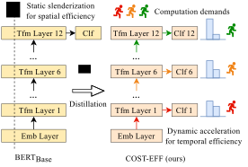
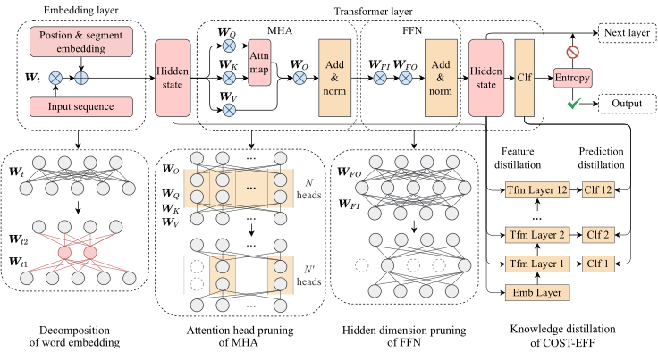

# COST-EFF

| Code of EMNLP 2022 paper<br>COST-EFF: Collaborative Optimization of Spatial and Temporal Efficiency with Slenderized Multi-exit Language Models |  |
| :---------------------------------------------------------------------------------------------------------------------------------------------: | :-----------------: |



---

- [COST-EFF](#cost-eff)
  - [1. Files and directories](#1-files-and-directories)
  - [2. Run COST-EFF](#2-run-cost-eff)
  - [3. Citation](#3-citation)

## 1. Files and directories

- `Costeff` Directory of COST-EFF Implementation.
  - `configuration_costeff.py` Model configuration (e.g., pruning dimension, number of attention heads)
  - `modeling_costeff.py` PyTorch implementation of COST-EFF model.
  - `pruning.py` Pruning utility.
  - `run_glue_costeff.py` Runner of COST-EFF procedure.
- `models` Directory of models.
  - `pretrained_model` Directory of pre-trained models (e.g., BERT, RoBERTa, ElasticBERT).
  - `finetuned_model` Directory of fine-tuned models (i.e., the models to optimize).
  - `TA_model` Directory of TA models. The TA model is an intermediate between the model to optimize and the COST-EFF model.
  - `costeff_model` Directory of COST-EFF models (i.e., the result of COST-EFF procedure).
- `data` Directory of datasets.
  - `glue` We use GLUE datasets in the paper.
- `requirements.txt` Automatically generated requirements file by Anaconda.
- `run.sh` Shell script of COST-EFF pipeline.
- `test.sh` Shell script to evaluate and profile COST-EFF.

## 2. Run COST-EFF

1. Run `conda create --name costeff --file requirements.txt` to create a virtual environment and download the dependencies.
2. Download the pre-trained model (e.g. BERT) and training dataset (e.g. GLUE) into the corresponding folders. Please refer to the README under each folder for details.
3. Modify and run the scripts `run.sh` and `test.sh` for model training and evaluation.

## 3. Citation

If you find this work helpful, please cite

```bibtex
@inproceedings{shen2022costeff,
  title={COST-EFF: Collaborative Optimization of Spatial and Temporal Efficiency with Slenderized Multi-exit Language Models},
  author={Bowen Shen, Zheng Lin, Yuanxin Liu, Zhengxiao Liu, Lei Wang, Weiping Wang},
  booktitle = {Proceedings of {EMNLP}},
  year={2022}
}
```
